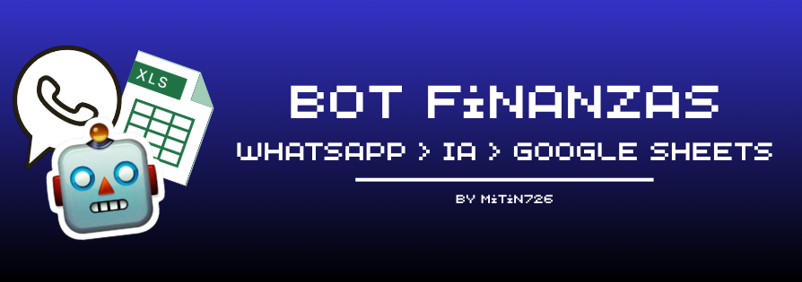

# Bot de Gastos por WhatsApp
 
Siempre me pasa que quiero llevar mis cuentas actualizadas, sin embargo, al tener que llegar a casa y escribir cada cuenta se volvía tedioso y muchas veces se me olvidaba. Es por eso que decidí crear un bot personal que registra gastos automáticamente en Google Sheets a partir de mensajes de WhatsApp en lenguaje natural, y que además responde preguntas sobre gastos pasados.

## Funcionalidades

- Registra gastos escribiendo mensajes como "ayer gasté 20 mil en el almuerzo"
- Entiende fechas relativas (hoy, ayer, antier, "hace X días") y fechas exactas
- Clasifica automáticamente la categoría del gasto
- Responde consultas como "cuánto gasté en comida este mes"
- Usa la API de Claude (Anthropic) para interpretar el lenguaje natural

## Tecnologías

- Node.js
- whatsapp-web.js (conexión a WhatsApp)
- Anthropic API (interpretación de lenguaje natural)
- Google Sheets API (almacenamiento)

## Instalación

1. Clona el repositorio: `git clone <url-del-repo>`
2. Instala las dependencias: `npm install`
3. Cambia `.env.example` a `.env` y completa las variables:
   - `MI_CHAT_PERSONAL`: tu ID de chat personal de WhatsApp (se obtiene la primera vez que corres el bot, revisando los logs)
   - `ANTHROPIC_API_KEY`: tu clave de la [consola de Anthropic](https://console.anthropic.com)
   - `GOOGLE_SHEET_ID`: el ID de tu hoja de Google Sheets
4. Coloca tu archivo de credenciales de Google como `google-credentials.json` en la raíz del proyecto (ver sección de configuración de Google abajo)
5. Corre el bot: `node index.js`
6. Escanea el código QR que aparece en la terminal con WhatsApp (Dispositivos vinculados)

## Configuración de Google Sheets

Este proyecto usa una **cuenta de servicio** de Google para leer/escribir en Sheets sin intervención manual.

1. Crea un proyecto en [Google Cloud Console](https://console.cloud.google.com)
2. Habilita la **Google Sheets API** para ese proyecto
3. Crea una cuenta de servicio (IAM y administración > Cuentas de servicio) y genera una clave en formato JSON
4. Descarga esa clave, colócala en la raíz del proyecto como `google-credentials.json`
5. Comparte tu Google Sheet con el correo de la cuenta de servicio (con permisos de Editor)
6. Copia el ID de tu hoja desde la URL (el valor entre `/d/` y `/edit`) en `GOOGLE_SHEET_ID`

## Estructura del proyecto

- `index.js` — punto de entrada, maneja la conexión de WhatsApp y enruta mensajes
- `interpretar.js` — interpreta mensajes de registro de gastos
- `clasificar.js` — clasifica si un mensaje es un registro o una consulta
- `consultas.js` — interpreta y responde consultas sobre gastos pasados
- `sheets.js` — lectura/escritura en Google Sheets
- `utilidades.js` — funciones compartidas (parseo de respuestas JSON)

## Arquitectura

## Notas

Este es un proyecto personal educativo, hecho para aprender sobre integración de APIs, procesamiento de lenguaje natural y automatización.

Made with ❤️ by Mitin726
